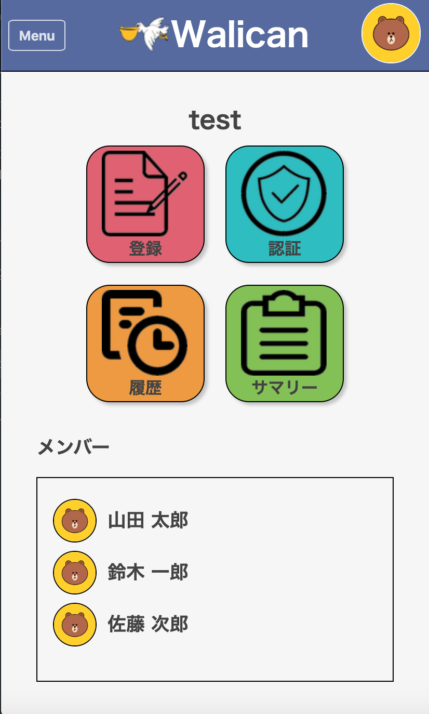
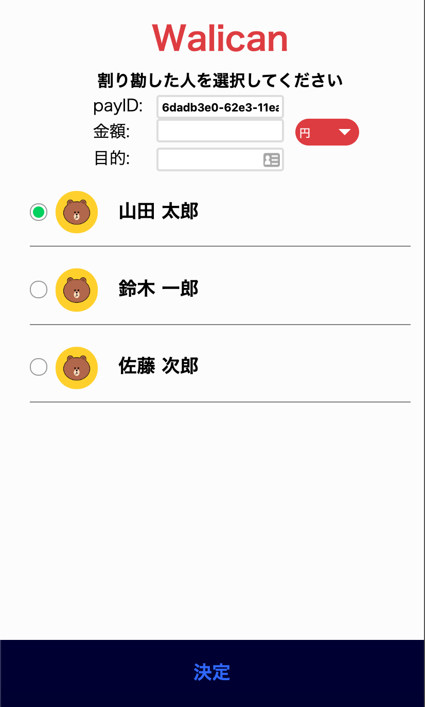
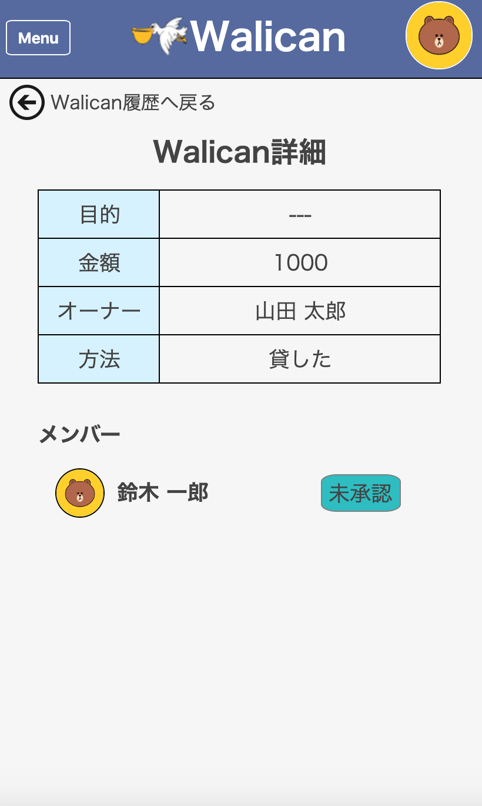

# Walican


It is a product that combines a line bot and a web application for managing money lending and borrowing between groups.

# DEMO

<div style="text-align:center;">

<p style="margin-top: 0; font-weight:bold;">Group Page</p><br>


<p style="margin-top: 0; font-weight:bold;">Regist Borrowing Page</p><br>


<p style="margin-top: 0; font-weight:bold;">Borrowing Detail Page</p><br>
</div>

# Features

- Walican can record lending money and splitting bills between groups.
- Walican can convert foreign currency to Japanese currency and record.
- You can check the exchange rate　by Walican.

# Requirement

Look at `package.json`.

# Usage

1. Make db dir.
```
$ mkdir db
```

2. Settings for using LINE api.
```
# .env

SECRET_KEY={your channel access key}
ACCESS_TOKEN={your channel access token}
HOST_URL={host url}

CHANNEL_ID={your channel id for login}
CHANNEL_SECRET={your channel secret for login}
```

3. Run docker-compose
```
$ docker-compose up -d --build
```